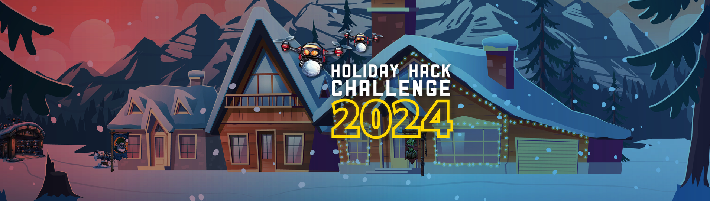

# Welcome

## Introduction

Hello and welcome to my write-up for the 2024 SANS Holiday Hack Challenge! This year's event, themed "Snow-maggedon," offers an immersive adventure where participants sharpen their cybersecurity skills through engaging real-world challenges set in a whimsical holiday environment.

This year, the challenge is structured into a Prologue and three Acts, each introducing new challenges and advancing the storyline:

- Prologue: Launched on November 7, 2024
- Act 1: Released on November 11, 2024
- Act 2: Scheduled for release on November 18, 2024
- Act 3: Scheduled for release on December 2, 2024

Participants are encouraged to share solutions to the Prologue, Act 1, and Act 2 challenges starting once the next section has been released. However, for Act 3, players must wait until after the competition ends before sharing their answers or solutions.

I extend my heartfelt appreciation to the SANS Institute and the entire Holiday Hack Challenge team for orchestrating this festive and educational event. Their dedication to fostering a global cybersecurity community through engaging and accessible challenges is truly commendable.

This write-up aims to assist first-time participants, cybersecurity enthusiasts, seasoned professionals, and everyone in between. Whether you're seeking guidance on a particularly tricky challenge or exploring the exciting world of cybersecurity, I hope this resource provides valuable insights and support.

Let's embark on this journey together, unraveling the mysteries of Snow-maggedon and enhancing our cybersecurity skills in the most festive way possible!

!!! warning Content Incomplete
    So far this write-up covers the just the objectives in the prologue. I shall include more content as I progress in the game and according to the sharing rules of the game.

!!! note "50-page submission limit"
    Each year there's a huge number of write-ups that need to be reviewed by the Counter Hack team. To find a good middle ground between preventing information overload and creating a write-up that can stand on its own as a learning resource, some parts, like the *navigation tip* below, are collapsed by default. Skipping over these will not take away from understanding the overall solution, but feel free to expand them to get some additional information.

??? tip "Navigation tip"
    Even with less than 50 pages, there's still quite a bit of information to read through. To make things a little easier, you can use ++"P"++ or ++","++ to go to the previous section, ++"N"++ or ++"."++ to navigate to the next section, and ++"S"++, ++"F"++, or ++"/"++ to open up the search dialog.

    **TL;DR** if you keep pressing ++"N"++ or ++"."++ from this point forward, you'll hit all the content in the right order! :smile:

## Answers

!!! success ":fontawesome-solid-trophy:{ .trophy-gold } 1. Holiday Hack Orientation - :fontawesome-solid-star::fontawesome-regular-star::fontawesome-regular-star::fontawesome-regular-star::fontawesome-regular-star:"
    Follow [Jingle Ringford's instructions](./objectives/o1.md) to see what to expect from Holiday Hack Challenge 2024.

!!! success ":fontawesome-solid-trophy:{ .trophy-gold } 2. Elf Connect - :fontawesome-solid-star::fontawesome-regular-star::fontawesome-regular-star::fontawesome-regular-star::fontawesome-regular-star:"
    Help Angel Candysalt [connect the dots](./objectives/o2.md) in a game of connections.

!!! success ":fontawesome-solid-trophy:{ .trophy-gold } 3. Elf Minder 9000 - :fontawesome-solid-star::fontawesome-regular-star::fontawesome-regular-star::fontawesome-regular-star::fontawesome-regular-star:"
    Assist Poinsettia McMittens with playing a game of [Elf Minder 9000](./objectives/o3.md).

??? tip "Credits"
    This write-up is published using the template created by Tomas Bouve available [here](https://github.com/crahan/HolidayHackChallengeTemplate). Thanks for giving back to the community.