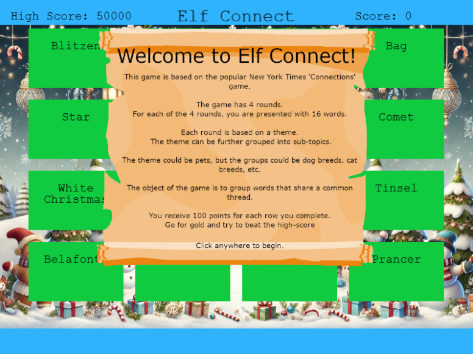

# Elf Connect

**Difficulty**: :fontawesome-solid-star::fontawesome-regular-star::fontawesome-regular-star::fontawesome-regular-star::fontawesome-regular-star:<br/>
**Direct link**: [Elf Connect website](https://hhc24-elfconnect.holidayhackchallenge.com/?&challenge=termElfConnect&username=darkhorse&id=266917d3-f81f-48bf-981c-c4bd92e95868&area=staging&location=31,14&tokens=hard,easy&dna=ATATATTAATATATATATATATATATATATATATGCCGTAATATATATATATTATAATATATATATATATATATATTAGCATATATATATATTACGATATATATATATATTAATATATGC){:target="_blank"}

## Objective

!!! question "Request"
    Help Angel Candysalt connect the dots in a game of connections.

??? quote "Angel Candysalt"
    Welcome back, island adventurer! I'm Angel Candysalt — so happy to finally meet you!
    I'm thrilled you're here because I could really use a hand with something.
    Have you ever heard of a game called Connections?
    It’s simple! All you need to do is find groups of four related words.
    I've been stuck on it all day, and I'm sure someone as sharp as you will breeze through it.
    Oh, and while you're at it, check out randomElf's score — they hit fifty thousand points, which seems… oddly suspicious.
    Think they might have tampered with the game? Just a hunch!

## Hints

??? tip "Elf Connect Easy"
    I love brain games! This one is like the New York Times Connections game. Your goal here is to find groups of items that share something in common. Think of each group as having a hidden connection or theme—four items belong together, and there are multiple groups to find! See if you can spot patterns or common threads to make connections. Group all the items correctly to win!

??? tip "Elf Connect Hard"
    WOW! A high score of 50,000 points! That’s way beyond the limit! With only four rounds and a max of 400 points per round, the top possible score should be 1,600 points. So, how did someone get to 50,000? Something unusual must be happening!
    
    If you're curious, you might want to check under the hood. Try opening the browser's developer tools console and looking around—there might even be a variable named 'score' that could give you some insights. Sometimes, games hold secrets for those who dig a little deeper. Give it a shot and see what you can discover!

## Solution

### Easy Mode

To complete this challenge in easy mode, we can try and guess the groups, or do some research to learn what the members of each group should be. We could do this programatically via the browser console to be able to get the expected answers. The information is contained in the website's javascript, which we can read and understand. To be able to see the group sets for each section, we can run the code "Display Correct Sets" available in the [code block](#code-blocks). An easier way is to run code "Automatically Select and Submit Correct Groups" which will automatically submit the correct sets and complete the round.

!!! success "Success! You have defeated the Elf Connect!!!!"

### Hard Mode

!!! question "But how we are going to exceed a high score of 50000?"
    :fontawesome-solid-bomb: Each round will give us a maximum score of 400. This means that the maximum we can get is 1600. 

To win the Gold trophy for this challenge, we just need to exceed the high score of 50000. Investigating the code, we can see that the script is just submiting an action with a value of 1, when the round is completed succesfully, and a value of 2 when the high score is exceeded. There is nothing going to, or coming from the server that determines the high score. So all we need to do is set the score to 50,000 or more at the start of the game, and when we get the first matching set, we earn the gold trophy. 

!!! success "Great Job Hacker! Elf Connect Complete and Hacked!"

### Images

{ width="800" }

### Code blocks

=== "Display Correct Sets"

    ```javascript linenums="1" title="Display Correct Sets"
    correctSets.forEach((set, index) => {
        console.log(`Set ${index + 1}:`);
        set.forEach(wordIndex => {
            console.log(words[wordIndex]);
        });
        console.log('----------------');
    });
    ```

=== "Automatically Select and Submit Correct Groups"
    ```javascript linenums="1" title="Automatically Select and Submit Correct Groups"
    correctSets.forEach((set, setIndex) => {
    selectedBoxes = set.map(index => wordBoxes.find(box => box.index === index));
    checkSelectedSet(mainScene);
    });
    ```

=== "Set the Score"
    ```javascript linenums="1" hl_lines="1" title="Set the Score"
    score = 50000
    ```

### Answers

=== "Round 1"

    | GROUP A | GROUP B | GROUP C         | GROUP D |
    | :------ | :------ | :-------------- | :------ |
    | Tinsel  | Sleigh  | Belafonte       | Comet   |
    | Garland | Bag     | Jingle Bells    | Vixen   |
    | Star    | Mittens | Crosby          | Prancer | 
    | Lights  | Gifts   | White Christmas | Blitzen |

=== "Round 2"

    | GROUP A   | GROUP B   | GROUP C | GROUP D       |
    | :-------- | :-------- | :------ | :------------ |
    | Nmap      | burp      | Frida   | Metasploit    |
    | netcat    | OWASP Zap | Cycript | Cobalt Strike |
    | Wireshark | Nikto     | AppMon  | HAVOC         | 
    | Nessus    | wfuzz     | apktool | Empire        |

=== "Round 3"

    | GROUP A   | GROUP B   | GROUP C   | GROUP D       |
    | :-------- | :-------- | :-------- | :------------ |
    | AES       | WEP       | Symmetric | Caesar        |
    | RSA       | WPA2      | Cycript   | One-time Pad  |
    | Blowfish  | TKIP      | hash      | Ottendorf     | 
    | 3DES      | LEAP      | hybrid    | Scytale       |

=== "Round 4"

    | GROUP A   | GROUP B   | GROUP C     | GROUP D       |
    | :-------- | :-------- | :---------- | :------------ |
    | IGMP      | TLS       | Ethernet    | HTTP          |
    | IPX       | SSL       | PPP         | FTP           |
    | IP        | IPSec     | IEEE 802.11 | SMTP          | 
    | ICMP      | SSH       | ARP         | DNS           |

## Response

!!! quote "Angel Candysalt"
    If you want a more difficult challenge, try beating randomElf's score.
