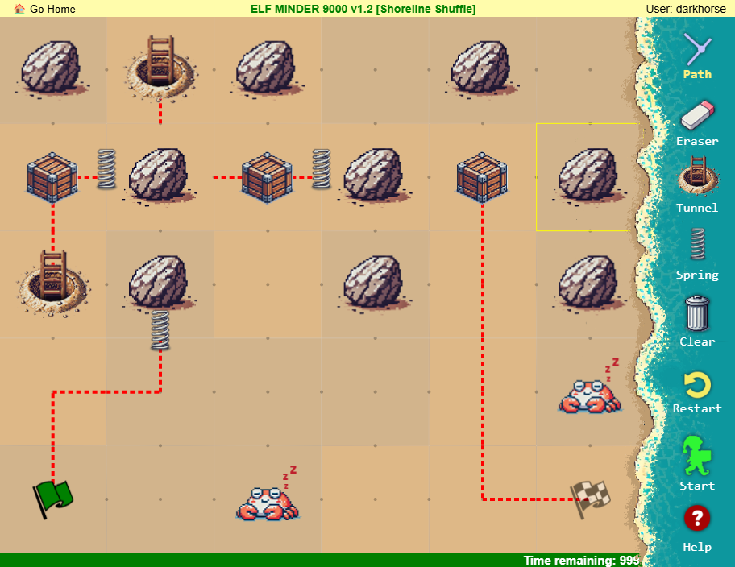
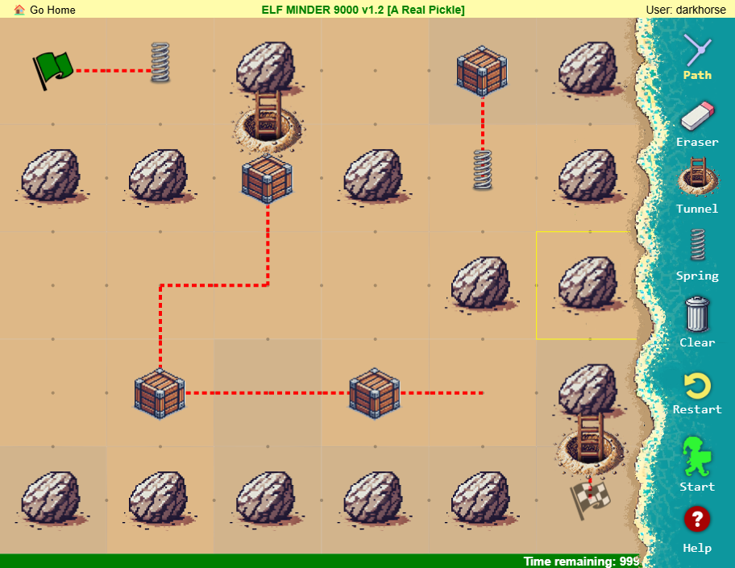

# Elf Minder 9000

**Difficulty**: :fontawesome-solid-star::fontawesome-regular-star::fontawesome-regular-star::fontawesome-regular-star::fontawesome-regular-star: 
**Direct link**: [Elf Minder 9000 website](https://hhc24-elfminder.holidayhackchallenge.com/index.html?&challenge=termElfMinder&username=darkhorse&id=33ae4647-0f01-4430-adf3-5b54319c77e0&area=staging&location=50,9&tokens=hard,termElfMinder,easy&dna=ATATATTAATATATATATATATATATATATATATGCCGTAATATATATATATTATAATATATATATATATATATATTAGCATATATATATATTACGATATATATATATATTAATATATGC){:target="_blank"}

## Objective

!!! question "Request"
    Assist Poinsettia McMittens with playing a game of Elf Minder 9000.

??? quote "Poinsettia McMittens"
    Center your mind, and become one with the island!
    Relax...
    This isn't working! I'm trying to play this game but the whole "moving back to the North Pole" thing completely threw me off.
    Say, how about you give it a try. It's really simple. All you need to do is help the elf get to the exit.
    The faster you get there, the better your score!
    I've run into some weirdness with the springs though. If I had created this game it would've been a lot more stable, but I won't **comment** on that any further.

## Hints

??? tip "Elf Minder 9000: RTD (Read the Docs)"
    Be sure you read the "Help" section thoroughly! In doing so, you will learn how to use the tools necessary to safely guide your elf and collect all the crates.

??? tip "Elf Minder 9000: TODO"
    When developing a video game—even a simple one—it's surprisingly easy to overlook an edge case in the game logic, which can lead to unexpected behavior.

??? tip "Elf Minder 9000: Reusable Paths"
    Some levels will require you to click and rotate paths in order for your elf to collect all the crates.

## Solution

### Easy Mode

Welcome to the world of Elf Minder 9000, a game that brings holiday cheer with a twist. For the most part, Elf Minder 9000 can be enjoyed without any hacking skills, offering a fun, festive experience. However, as the levels progress and challenges become more devious, a bit of holiday "hacker magic" might be just what you need to prevail. When the game becomes a real nutcracker, clever workarounds and some elven shenanigans are often the keys to success.

Each level in Elf Minder 9000 has two scoreboards:

- Good Boss Mode
    In this mode, players aim to finish the level with the least number of segments and in the shortest possible time. It rewards efficient and precise gameplay.
- Evil Boss Mode
    This mode flips things on its head—the goal is to take longer, pass through as many segments as possible, and make the fewest rotations. It's all about taking the scenic route and making the journey delightfully inefficient.

Some of the more beginner-friendly levels, such as Sandy Start, Waves and Crates, Tidal Treasures, Dune Dash, Coral Cove, Shell Seekers, Palm Grove Shuffle, Tropical Tangle, and Crate Caper, can be completed without relying on any special tricks or hacks. They provide a great introduction for players of all skill levels.

My eight-year-old daughter enjoyed playing Elf Minder 9000, and it was a joy to watch her enthusiasm grow. However, she quickly learned an important lesson—sometimes, simply playing by the rules won’t get you a place on the leaderboard!

When we reached Shoreline Shuffle, it became clear that a bit of creative ingenuity was required. Digging into the code behind the scenes, we stumbled upon something interesting in **guide.js**. There was a constant called **whyCantIHoldAllTheseSprings**, which logs in the browser's console when the hero attempts to pass over three springs—something that shouldn't be possible since the game only lets you use two springs by default. This clue led us to explore the **game.entities.push()** method, which, as it turns out, allows us to directly add objects into the game.

With this newfound discovery, we realized we could place springs adjacent to boulders, a feat that regular gameplay mechanics would not normally permit. By leveraging these sneaky elven hacks, we successfully conquered Shoreline Shuffle. Here's what we ended up with for that level:

{ width="800" }

When passing the 3rd spring, we also saw this message in the browser console!

??? example "WHY CAN'T I HOLD ALL THESE SPRINGS??"
                                        

                                     WHY CAN'T I HOLD ALL THESE SPRINGS??

                                            
                                                    .--======-                                                          
                                                --              --.                                                     
                                            -=                     =:                                                  
                                        .=                         -                                                 
                                        -.                            -                                               
                                        ::                             .:                                              
                                        :                               :.                                             
                                        +                                 -                                             
                                    .-                                 :                                             
                                    ::                                 .-                                            
                                    ..                                  =                                            
                                    :                 :.                =:                                           
                                    :                                  =:  -                                         
                                        =                                *    -                                         
                                        ..       :        .:. ..              -                                         
                                        .                                   :.                                         
                    =.   .++:  ..        .   .                 :            =                                           
                +  *=.       =         -       .         *@@ .+          #                                            
                -+-     .:-**--::::     =               :+#%*-.          .:                                            
            :-   -+.            -      = .@@# *                        =                                             
        .#   .*               :-       .: #+:                          :                                             
        +   +=     -#.            -        =       :                     -                                             
        #        .=                =        .      +                      -.             .=++-         :-               
        =      -.          .++=-=+-         .     =        -                    ..:----    ...           ::             
        +   .-     :=.      : ..-+%+         +    :-   :: ..                           -***+++++=          =            
        -      .+        ..-::   *%:--.      +     -          .-*:                  .++*++++----::.       ..           
        .:   #       =%:.-:.    :*#:=+%=      #           .***+--=::--:..  .-:      :++*-::----:::....:    =           
        #      .+.   -.::    ..=#=: .*#.      .=  :+**:.+**==+:...:::::::::-. +:  :.-++.          .::-... +           
        +           .:.:    .--*... .#+-:=**-   -.     -+*+#+-.  -          .-=#. :.*:+*=..          .:- - -          
        =        ++=-.:    ..-*-..  ++::---*%- :=-.    -++*:    ..           =%#. :.-*-:=*+-.....      .-.+ -.        
        =       :*==.-.   ..-*:..  =:.-...:=%=....::   .:++++. :-......-===*#%+. .=:--+..::-+*+=---..   =#*. :        
        +       +*=*=-.  ..-*::. -+...     =#:.=+*%-+  . --:-++*********=:.-::**.:=..:=+:  :... :+**###%@*.   #       
        +       **=#=#   -*+:.-=+= ..     -*.-.   ##.   :..*+--:.......:-:   .*#:::  .:. =+.    :-:....:.      -      
        +       -***+=-+*+:-: ==..:.     =-.:     *#:.=#+::--===:         .-+%#::.+=+-...:..-==.     .+#=      :      
        +        ++++++-:===+=..:.-    .+:.:    .=*-:..:##-..:.....:::::::-=-:..:-.=.    ..:....:+###%#-        *     
        =          .-.:--:.:-:.:=:    ==...    .-+.:   .+%:+#+.-..::::...:---:=+:.:-=.         :-::...           :    
        ..         +  -...-=.  .+- .+-.::     .=- .  .:=**-==*%==            -+#- .:.:=:         .--=            -    
        :         *  -   . -****-.-::-.:    .+...  :: -=.-:.=%=**.          +%#=+-..::.-*=:.     .+#:            #   
        -         *  -     ..:::::. .=-.  :=..:  ... .:..+-.=%=+%========+#%*::=      .:.. :*#**#%-              .  
            =        :  =         ..=+-:=====..:.  ... -....=- +.-=*-........--.-=-=.   +    ..:::::.                :  
            *        ..:            ......-::.--. .-:=:..  . =+.:-=.:       . =-=#=.:=-..--      :-*                 -  
            :.        -.                 .==:.-=. -+:..     -= ::::.        ::-+*%-:...=+=...    :+#.                =  
            .        =.                  .  ....=-:.      -:.:==:.-.:.... .-=+%#:    ... .=**+*#%#:                 .: 
            :        -                   . .:..+=-+.   -=..:+.=.:-..........:::-=--:..    .:::::.                   .- 
            :        .=  = .:           .=   .=. .....--....=:.--:      .:.+=..=*+- ..::.    +==.                    + 
            :         -   =  .-         .:     =  ...-+=-:--::=.   ....:.:.:.  =%=.:-.  .=.. :*#.                    + 
            -         :  ==    +.        :=     :-  ...::...::--==-......=:-==#%-  ....:=**#%+.                     + 
            -          . .=:     +       .:.:     *        .-=--:...-=========:-*:      .:---+-.                     + 
            -             -+      -       :.*      =:      : +-     ...:---. -:-*+        :-** -                     + 
            -             :=..     .+       *        +     .:.:+         .:=- .*%-.-+==--=*%+. =                     + 
            -              .- :=      :=++==.         .-   ..+:-==-.      .-=##+=+.....-===*-  :==:                  + 
            -               .-   =                      -.  . = ..............=*#-:-===+##*=--.                      + 
            -                =-%=                        -:  .:.-.         .-+#+. .:.:=-:                           -  
            -                 - :*.                       -    ..:..::--:.. .-. :==*                                :  
            =                 : - .+                      .-        .*+.                                         =    
            =                = *    .=                      -+====:                                            :.    
                =               = -.      --                                                                     :      
                :              =  :          .---:::                                                           =       
                =              =  -                   .==..                                                  +         
                -                :                            .+*+.                                      :=           
                -.             :.                                        ::---=+**+-.               -#:              
                    ..            *                                                           :                         
                    ::           #                                                           -                         
                    :          +:                                                          :.                         
                    :.      :-.                                                           =                          
                                :                                                           .                          
                                :                                                          -                           
                                -                                                         .-                           
                                =                                                         -                            
                                -                                                        ..                            
                                -                                                         +                              

!!! success "Success! Once we have completed the 12 Games, we are awarded the Silver Trophy"

### Hard Mode

Upon completing the first twelve levels, we earn the Silver Trophy, which unlocks an even trickier mode called **A Real Pickle**. This is where things start getting even more entertaining, as the stakes rise and the puzzles become truly brain-bending. However, now that we have learned that it's not about bending the spoon, but believing there is no spoon, we can place springs and tunnels wherever we want! This newfound ability allows us to place tunnels at the edge of boulders, making it much easier to reach the finish line.

{ width="800" }

!!! success "Success! We are awarded the Gold Trophy"

At this point, we could go back and try to get our name on one of the scoreboards, but there is still so much more to learn.

## Response

!!! quote "Poinsettia McMittens"
    The rest of these elves are like corporate zombos. They just run around in circles unless you give them some direction.
    Way to pass them some of your super centered energy. Better you than me, though. I'd let them walk themselves straight off the island.

    You took the easy win, it seems we're kindred spirits. But there's also a hard way to solve this challenge.
    The more segments you use, the higher the reward. But who actually wants life to be more difficult?
